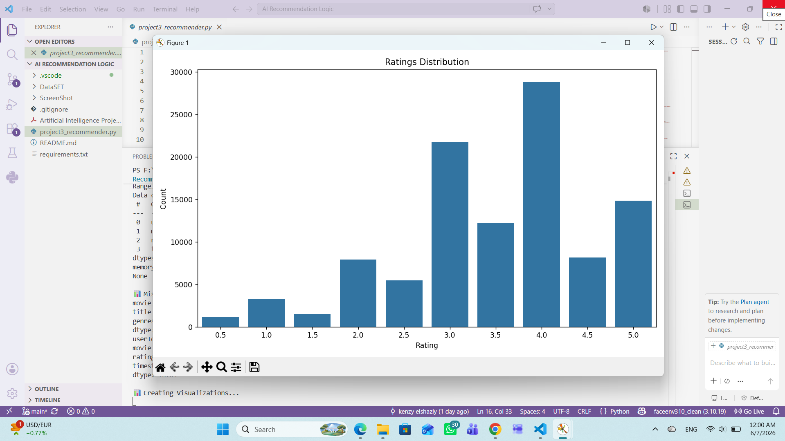
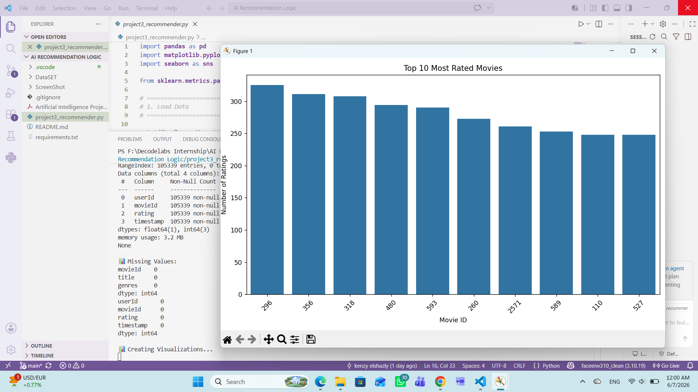
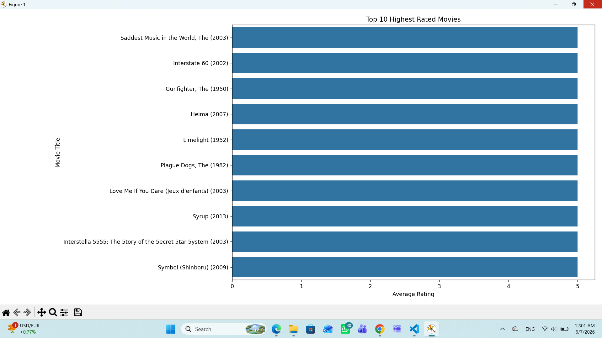
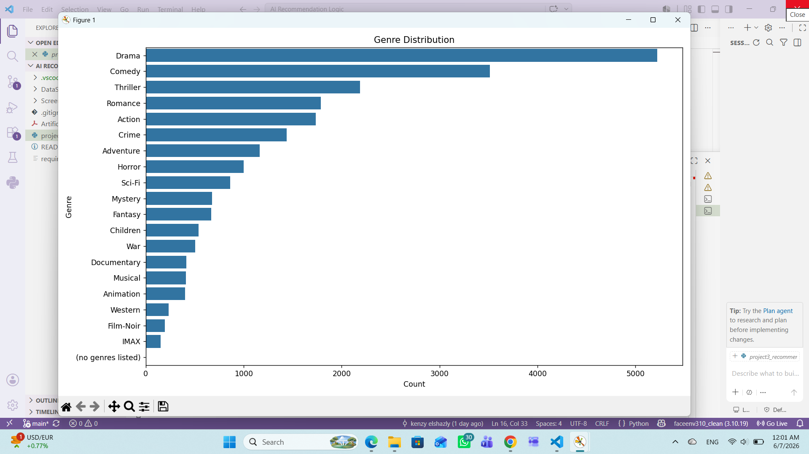
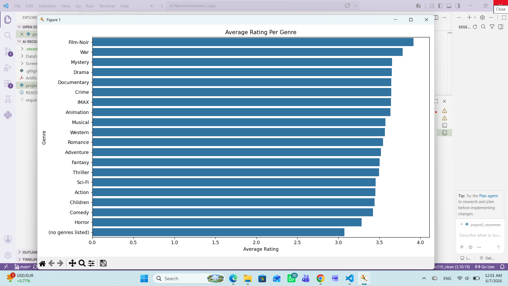
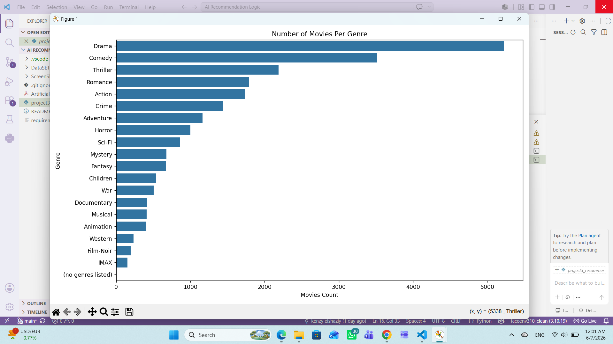
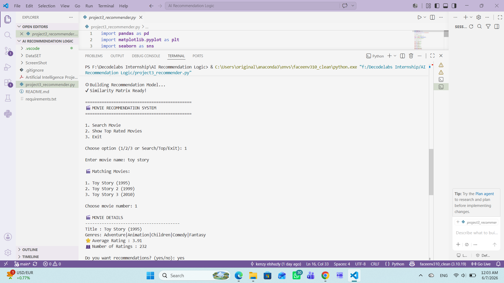
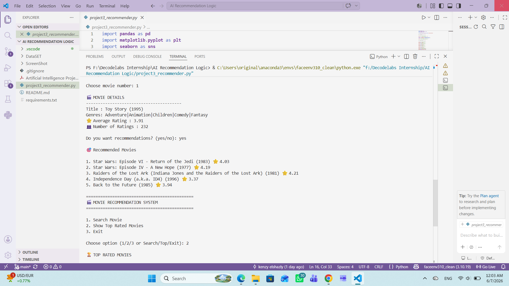
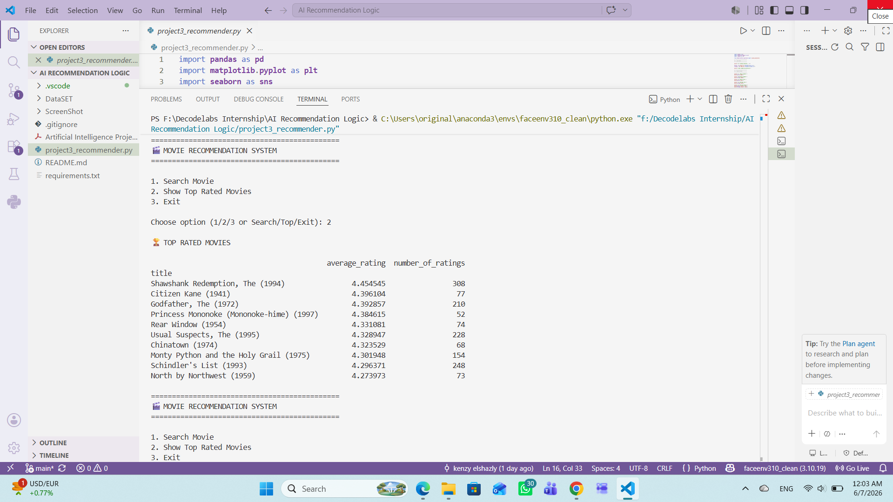
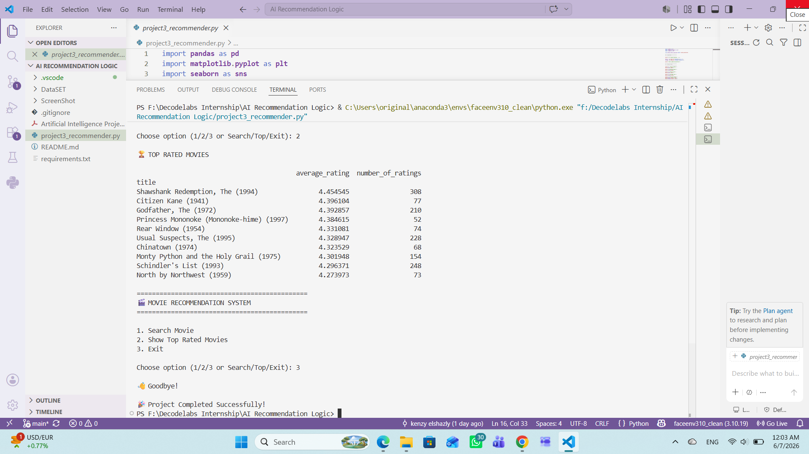

# 🎬 Movie Recommendation System (AI Project)

## 📌 Project Overview
This project is a **Movie Recommendation System** built using Python and Machine Learning techniques.  
It analyzes user ratings and recommends movies based on similarity between users' preferences.

The system also includes:
- 📊 Data Analysis
- 📈 Data Visualization
- 🤖 Machine Learning (Cosine Similarity)
- 🎯 Interactive CLI (User Input System)

---

## 📂 Dataset
The project uses the **MovieLens dataset**, which includes:

- movies.csv → Movie details (title, genres)
- ratings.csv → User ratings for movies

---

## ⚙ Features

### 📊 Data Analysis
- Missing values check
- Data exploration
- Movie statistics (ratings count & average)

### 📈 Visualizations
- Ratings distribution
- Top rated movies
- Genre distribution
- Average rating per genre
- Most rated movies

### 🤖 Recommendation System
- User-based similarity using **Cosine Similarity**
- Movie-movie similarity matrix
- Top 10 recommended movies based on input

### 💻 Interactive System
- Search for a movie
- View top rated movies
- Get recommendations instantly

---

## 🧠 Machine Learning Technique
- Cosine Similarity
- Pivot Table (User-Movie Matrix)

---

## 🚀 How to Run

```bash
pip install -r requirements.txt
python project3_recommender.py

---

## 📁 Project Structure

```text id="final_struct"
movie-recommender-ai/
│
├── project3_recommender.py
├── requirements.txt
├── movies.csv
├── ratings.csv
└── README.md
```

---

## 🖼️ Results / Screenshots

Below are sample outputs of the system:












---

## 📌 Notes

* Ensure all datasets are placed in the correct directory
* Install all dependencies before running the project
* The model works best with complete MovieLens dataset

---

## 👩‍💻 Author

Kenzy Mohamed

---
